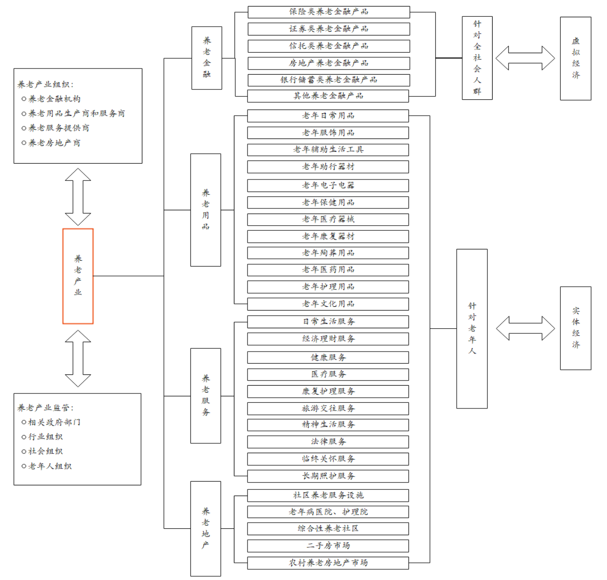

**注：部分内容直接来源于参考文献，具体参考文献已经附在文末，如有侵权，请邮件联系我**

## 养老产业

据国家统计局2020年2月颁布的《养老产业统计分类(2020)》定义，养老产业，是以保障和改善老年人生活、健康、安全以及参与社会发展，实现老有所养、老有所医、老有所为、老有所学、老有所乐、老有所安等为目的，为社会公众提供各种养老及相关产品（货物和服务）的生产活动集合。包括专门为养老或老年人提供产品的活动，以及适合老年人的养老用品和相关产品制造活动。

养老产业有广义和狭义之分，广义的养老产业指为个体提供生命保障的相关产业，养老产业不能单一归类于某一产业，而是涵盖了第一、第二、第三产业的综合性产业体系。狭义的养老产业指服务于60岁以上的老人，面向居家老人、社区及养老机构，围绕医、康、 护、养等需求，为老年人提供衣、食、住、行、用、娱、医等物质精神文化多领域产品服务。这里所说的养老产业，通常是狭义的养老产业。

## 养老产业分类

### 经济行业分类

按照经济行业，养老产业大致可以分类12大类：

- 养老照护服务（居家、社区和机构的养老照护服务，如助餐、助行、助急、助浴、 助洁、助医、日常照料等服务）
- 老年医疗卫生服务（健康保健、疾病诊疗、康复护理、安宁疗护等服务，主要和国民经济中的医院、卫生院相关）
- 老年健康促进与社会参与（老年体育健身、文化娱乐、老年旅游、养生保健、老年志愿等服务）
- 老年社会保障（社会保险、社会救助、社会福利、彩票公益、慈善等）
- 养老教育培训和人力资源服务（养老相关专业、职业、技能教育，已经相应人力资源的就业服务）
- 养老金融服务（老年人寿、健康、意外伤害、年金、住房反向抵押保险，养老理财、信托、债券等服务）
- 养老科技和智慧养老服务（生命科学研究、实验、推广、应用，养老产品质检，互联网、物联网、大数据、云计算养老）
- 养老公共管理（政府养老管理、社会组织管理、老年法律援助、养老传媒、养老代理、老年婚姻、养老展览）
- 老年用品及相关产品制造（食品、日用品、药品、健身产品、休闲娱乐产品、保健用品、医疗器械、康复辅具制造）
- 老年用品及相关产品销售和租赁（用品、器械、康复辅具销售和服务）
- 养老设施建设（设施建设、改造及装修维修，适老化及无障碍改造）
- 其他养老服务

### 需求属性分类

养老产业按需求属性的不同，可以分为医疗保健业、日常生活用品业、家政服务业、房地产业、保险业、金融业、娱乐文化产业、旅游业、咨询服务业、其它特殊产业等十个细分产业。

- 老年医疗保健业：老年医疗保健业是指为老年人提供医疗保健药品和医疗器械，主要涉及到药品、保健品、医疗器具、健身器材、康复器材、老年人常用的辅助医疗设备、疗养休养、住院陪床伺候等产品的生产与服务。
- 老年生活用品业：老年生活用品业是为老年人提供诸如手杖、服装鞋帽、饮食、餐具、防滑器具、放大镜、助听器、拐杖、轮椅、成人尿布以及其它方便老人的专用品，比如座椅式便桶，升降式轮椅或床，呼叫器或警报器等。
- 老年（家政）服务业：老年服务业是高年龄段老人尤其需要发展的项目，主要以家庭护理、日常家庭照顾、家庭修缮以及各种用品修理等为主。主要包括家务服务，包括家务、购物、打扫卫生、整洁环境、洗衣等事务；活动服务包括用餐、洗澡、淋浴、上厕所、陪同上街、逛商店、换衣服等；友爱服务包括电话交谈、上门交谈、聊天、代写书信、生活谈话、网上聊天等。
- 老年公寓（房地产）业：老年公寓（房地产）业主要为老年人提供建筑设施，如老年公寓、托老所、护理医院、敬老院等。住房对于老年人来说是养老和安身之处，拥有住房是一件十分重要的事情。但是，如果住房不能根据老年人的特点设计修建，那就会给老年人的生活带来诸多不便。比如，老年人由于年老体弱，楼层不宜住得太高。由于视力衰退，要求房间透光好。由于行动不便，要求有防滑防跌设施等。
- 老年保险业：老年保险业是为老年人提供人身保险、健康保险、养老保险等。人们都希望健康、长寿、晚年生活幸福，希望在遇到疾病、特别是重大疾病时能够得到医治，在年老体弱，没有经济收入时，生活能得到保障。随着市场经济体制的建立，社会保障制度和医疗制度的改革，以及与家庭变迁相联系的家庭保障功能的弱化，人们特别是老年人的保险意识增强，对保险的需求增大，保险业在老年人中将会有一个很大的市场。
- 老年金融业：老年金融业是指随着老年人社会保障制度继续推行和保障面的不断扩大，以后老年人的经济状况将会越来越好，会有一些理财观念很强的老年人购买金融产品，储蓄、证券投资、期货投资、理财咨询等。
- 老年娱乐文化产业：很多老年人在退居、赋闲时，有了大量的空闲时间开展娱乐文化活动，丰富自己的精神文化生活。娱乐方面包括老年活动中心、老年茶园、老年棋牌室、阅览室、歌舞厅、游乐场等，文化教育方面包括老年大学、老年职业培训、各种学习班等老龄教育产业。
- 老年旅游业：老年人对旅游也情有独钟。他们在度过了繁忙紧张的职业生活之后，希望晚年生活能够过得轻松、和谐、愉快而有意义，游览名山大川，尽享旅游之乐，成为许多老年人休闲活动的一种重要选择。在当今，外出旅游已开始成为许多老年人追求的一种时尚，特别是经济发达的国家更是如此。
- 老年咨询服务业：老年人由于生理心理的原因，在老年生活中会遇到许多问题和困难，需要社会给予帮助解决。以老年人为对象的咨询服务将会受到老年人的欢迎，如解决老年人心理障碍的心理咨询，为老年人健康提供帮助的健康咨询，为老年人提供法律帮助的法律咨询，以及为老年人日常生活提供帮助的家政咨询等。
- 其它特殊产业：其它特殊产业是指有些老年人有着自己特殊的喜好，这些需求不具有普遍性和通常意义上的不可或缺的特点，如古玩等老年消费品、老年特殊需要品，花卉种植、老年表演、老年交谊、老年气功、书报影视等。

## 我国养老现状

按联合国标准：国家60岁以上人口数占总人口数的比例超过10%，或者65岁以上的人口数占总人口数的比例超过7%，意味着该国进入老龄化社会。法国是世界上最早进入老龄化社会的国家，1851年60岁人口占比超过10%，其他发达国家紧随其后，英国、德国、美国和日本分别于1929年、1932年、1942年和 1971年先后进入人口老龄化社会。

我国于2000年起步入老龄化社会，且老龄化程度不断加深、呈现高龄化特征。《国家人口发展规划（2016-2030年）》预计，2030年60岁以上老人占比将到达25%左右；据世界卫生组织预测，2050年中国将有35%的人口超过60岁，成为世界上老龄化最严重的国家。

从老年人增速来看，2019年我国60岁以上人口2.53亿人，65岁以上人口1.76亿人，占比12.6%，总人口增速仅0.33%、而60岁以下人口增速仅0.02%，老年人口增速远超总人口增速。从老龄化加深速度来看，根据 2020 年人口普查结果，我国 65岁及以上人口占比13.5%，老龄人口数量庞大、占比快速提升。《中国发展报告2020：中国人口老龄化的发展趋势和政策》指出，“十四五”规划期间，中国将由老龄化社会进入到老龄社会。到本世纪中叶，中国人口老龄化将达到最高峰，65岁及以上养老人口占比将接近30%。

截至2019年，我国平均家庭户人口2.62 人，较2010 年减少0.48人；同家庭户规模和老年人口抚养比差距逐渐扩大，未来的家庭养老负担将会进一步加重。我国2019年65岁以上人口占比12.6%，老龄化程度与美国1991年、韩国2015年的水平相当。彼时，其人均GDP均约2.5万美元、人均可支配收入均超1.5万美元；而 2019年我国人均GDP仅10217美元、人均可支配收入仅4449美元，存在较大的“未富先老”问题，老年人群的养老金来源亟需扩充。

## 产业规模

我国推行的养老模式主要为“9073”模式，这一模式最早在“十一五规划”中由上海率先提出，即90%的老年人由家庭自我照顾，7%享受社区居家养老服务，3%享受机构养老服务。形成以居家为基础、社区为依托、机构为支撑的养老模式。目前我国的养老模式结构为居家养老占市场份额96%，社区养老占3%，机构养老占1%，距离国务院提出的“9073”模式结构尚有差距。

2020年，养老产业首个国家统计分类出台，明确了包括养老金融服务、养老科技和智慧养老服务在内的12类养老产业全链条范畴，给养老产业经济规模统计指明方向。

政策推动下，大批养老相关企业涌现。企查查数据显示，近10年养老相关企业注册量逐年攀升，2010-2013年相关企业年均注册量为4035家，2014年达到1.19万家，同比猛增71.8%。2019年相关企业注册量达3.8万家，较十年前数据增长了151%。2019年中国养老产业市场规模达6.91万亿元，2020年上升到7.18万亿元。安信证券发布研报称，2022年养老市场规模预计达10.29万亿元。根据中国社科院的《中国养老产业发展白皮书》显示，预计到2030年我国养老产业市场可达13万亿元。

2016-2020年，全国养老服务机构数量虽然由2.8万个增长至3.8万个，养老服务床位也由680万张增长至823.8万张，但是相对于庞大的市场需求来说还有上涨空间。另外，目前养老市场两极分化，一种是高端养老地产项目不符合多数人群需要，另一端是当前大部分的养老机构交通不便，服务质量不高，不符合对中档养老机构的需求。

据AgeLifePro统计，截至2020年底，已有至少11个国家的40家公司进军中国养老市场，遍布17个省份，已建成44个项目，这些外企中有12家来自美国，11家来自日本，11家来自欧洲，1家来自韩国，1家来自新加坡。其中，美企和日企成为进军中国养老市场的大部队，占比超过50%。在中国的养老市场，美国、日本、欧洲的三足鼎立局面已经形成。

## 养老支柱结构

国际上普遍选择国家、单位、个人养老责任共担的三支柱养老金体系。在我国，基本养老保险作为第一支柱一支独大，但替代率不高。企业年金作为第二支柱，发展缓慢且覆盖面小。个人储蓄性养老保险和商业养老保险作为第三支柱，有着多层次、多领域、跨部门的综合发展潜力因而被寄予越来越多期望。

当前的养老产业已初步形成几大独特的商业模式。以万科、保利、远洋为代表的地产类，以泰康人寿、太平人寿、友邦人寿为代表的中外资险企，九如城、同仁堂、英智康复等综合类，首开、首创、诚和敬等地方国资类等，都在大健康的朝阳行业中找准了切入点，并在细分的赛道上快马扬鞭。

从市场主体看，大致可以分为六大类

养老机构已与与医疗卫生机构展开不同程度的合作，例如部分病床使用率较低的一级、二级医院或乡镇卫生院、社区卫生中心，结合当前公立医院改革，嵌入养老服务，扩大养老服务供给。又如险企与养老社区的结合，既有中国太保这类以重资产投入模式自建养老社区，实现养老纵深发展。也有以友邦人寿为代表的轻资产投入型，打通医、药、健、护、养全程康养服务。

## 我国养老产业发展的五个阶段

### 快速发展期（2011-2020年）

人口红利逐渐减少，人口老龄化发展迅速，60岁以上老年人口占总人口比从2011年的13.7%发展到2018年的17.8%。中国逐渐形成了“9073”的养老格局，养老政策体系也逐渐丰富。政策的引导和社会力量的参与，让养老服务和产品有效供给能力大幅提升、供给结构更加合理，养老服务政策法规体系、行业质量标准体系进一步完善。

### 爆发期（2021-2030年）

养老产业的法规体系基本建立，养老产业相关标准基本确立，行业协会的约束基本形成，养老产业发展模式探索基本完成。养老产业向规模化、规范化、全面化方向发展

### 成熟期（2031-2050年）

养老产业发展趋向成熟，整体进入平稳增长阶段，养老产业也成为国民经济支柱产业之一。

### 减速期（2051-2070年）

随着“计划生育”时期出生人群的老去，老龄人口总数相对上一阶段减少，产业增长可能出现减速。

## 行业及服务框架

### 基本框架

养老产业包括养老金融业、养老房地 产业、养老用品业和养老服务业四个部分，其中养老用品业、养老服务行业和养老房地产业主要为老年人群提供相应产品和服务，养老金融业除了为老年人群提供相应金融服务外，还包括为年轻人 群老年期做好安排的养老金保障和对养老产业进行投资的金融活动。

### 养老金融业

从狭义上来看，养老金融是指由有关金融监管机构统一管理、以解决养老问题为目标、以养老产业为依托，由社会基本养老保险、企业年金、商业养老保险、养老储蓄、养老住房反向抵押贷款、养老信托、养老基金等金融服务方式组成的统一体系。从广义上来看，是指为满足全 体社会成员养老需求而开展的各种金融活动。具体包括：①养老金制度安排和养老金资产管理；② 金融机构围绕老年人财产管理需求而进行相关金融服务；③金融支持养老产业投融资及其发展；④ 健康管理、法律顾问和财产保障等创新领域。

### 养老房地产业

从事与老年人及全体公民老年期相关联的房地产开发、经营、管理和服务的产业。 从居住属性讲，主要包括社区养老服务中心、老年公寓、老年社区、护理院和老年人原有住宅等建 筑设施以及相关配套措施。

### 养老服务业

提供各类动态服务以满足老龄需求。按照服务内容分为日常生活服务、经济理财服务、健康服务、医疗服务、康复护理、旅游交往、精神文化生活、法律服务、临终关怀和长期照护服务等。

### 养老用品业

为老年人提供各类适老化实体产品。按照产品需求细分为日用品、服饰、辅助生活 工具、助行器材、电子电器、保健用品、医疗器械、康复器材、医药用品、护理用品、文化用品和殉葬用品等。

## 产业全景

### 产业全景图

### 产品服务的上游

上游是养老产品和服务，是养老产业的核心环节，因为其承担着为整个产业链提供产品和服务的任务。以老年人为服务对象，根据老年人生理特点和生活需要，提供金融、地产、用品等产品和服务。

当前养老产品和服务更多聚焦于服务失能、半失能老人，开发各类床位建设及配套服务，忽视初老群体，导致了形式过于单调，而多个产品市场未被开发的问题。以旅游、社交、教育、康养需求相关的产品和服务为例，涉足供应商明显少于地产、金融、用品领域，发展尚不成熟。

未来养老产品和服务需要进行消费升级的变化和健康需求的转型，需要多样化、专业化、针对性的市场开发。向低功耗、微型化、智能传感、室内外精准定位等方向不断完善，突破现有的健康生理检测、监测技术和分析技术。最后呈现普惠化、个性化、智慧化三化发展趋势。

目前，我国养老院行业上游的金融环节代表性企业有泰康人寿、中国平安、中国人寿等;房地产环节代表性企业有万科地产、华润置地、保利地产等;养老保健品环节代表性企业有汤臣倍健、善存、东阿阿胶等;养老设备环节代表性企业有鱼跃医疗、三诺生物、睿餐智能等。

### 服务集成的中游

中游是传统营销渠道与养老驿站、日间照料中心、社区等平台对养老产品服务的集成。通过直营店、商品超市、经销商、电商平台、社区、机构等形式触达消费者。

企业在完成产品服务的生产后，需要建立自己的营销网络。除常见的营销渠道外，由于养老产业具有一定社会性和公益性，社区和机构成为产品服务集成平台。社区作为平台，能够整合社区内各种服务资源，为老人提供助餐、助洁、助浴、助医等产品和服务；机构作为为老人提供集中居住和照料服务的机构，也是养老产品服务集成渠道之一。

未来除了老人直接进行直营店、网络、电话平台购买的行为外，还有基于互联网的综合服务模式、智能居家养老模式、社区街道医养护一体化模式。

服务中游的养老院环节代表性企业有泰康之家、亲和源、凯健华展等。

### 消费需求的下游

是接受服务的老年人群体。老年人群体大体可分为具备完全自理能力、具备半自理能力和不具备自理能力三大类，不同类别的老年人群具有显著的需求差异。下游的需求反馈是推动养老产业不断向前发展的原生动力之一。

按照马斯洛需求层次，同样可以把老年人的需求划分为生理需求、安全需求、情感需求、尊重需求和自我实现需求。从大的方面可以划分为健康管理需求和医疗保健需求、生活起居及精神慰藉需求。

- 健康管理需求和医疗保健需求：需要通过采用健康检测预警设备、吃药提醒设备、生活保健设备、康复护理设备以及综合软硬件产品的综合养老解决方案，实现对老人健康数据采集、信息记录和智慧化健康管理。建立家庭、社区、医院的互联互通及全面对接，为老人营造及时、安全的专业医疗服务。
- 生活起居及精神慰藉需求：老年人在日常生活中普遍存在生活起居照顾、安全保障、社交沟通、文化娱乐等需求。对此，可以使用老人防丢设备保障老人人身安全，使用家庭护理机器人全面照料老人的生活起居，使用家庭娱乐设备丰富老人的生活内容，满足其精神层面的需求。

## 消费市场变化

我国养老市场竞争格局总体呈现“9073”结构，家庭养老产品服务占比最大。在家庭养老产品服务市场中，养老用品市场份额最大且发展后劲足。一方面，养老用品受新一代信息技术发展影响，智慧健康养老用品发展迅速；另一方面，目前我国养老用品市场需求覆盖率不足20%，仍有约80%的需求和产品有待开发。

2023年、2040年将是我国新增老年人口的释放拐点。我国出生人口总量曾经历1960-1970年和1980-1999年两次小高潮，即“60后”“80后”“90后”的出生。具有较高储蓄能力的“60后”预计2023年开始老去；“80后”预计2040年步入老年生活，这两部分人群将形成养老市场中的新消费力量。

另一方面，2023年、2040年将是我国养老消费转型的重要拐点。养老市场的消费行为主要由老年群体及其子女完成。无论是2020年开始承担父母养老的“80后、90后”，还是2040年开始老去的“80后、90后”，这代人特有的消费能力、消费观、消费形式，都将为养老产品服务发展带来转变。因此，2023年、2040年将是我国养老市场发展的重要拐点。

“80、90”后对养老的不同认知和消费观，将为市场来带超预期的消费能力。未来理财意识、互联网思维、高性价消费形态将进一步撬动养老市场。

## 商业模式

### 经营模式

以前可以分为三大经营模式

- 载体运营，载体运营又分为纯自营与合作建设
- 设备运营，设备运营又分为直接相关与周边配套
- 服务运营，即基于老年人不同层次需求衍生的服务

不过当前我国养老领域企业的经营边缘不断模糊化，从单一服务商逐渐向综合性服务商转型。

### 商业模式

由于市场巨大，商业模式也有很大的想象空间，以下罗列六大类商业模式：

### 盈利情况

人口学家、北京大学人口所乔晓春教授曾表示：“只有4%的养老机构实现盈余，超过60%养老机构需要10年以上时间才能收回投资。那么，小规模的养老驿站生存更是困难。”

从盈利情况看，养老机构1到3年收回投资的仅占4.5%，4到6年收回投资的占4.9%，10年以上收回投资的占62%。经营方面，在考虑了政府补贴的前提下，实现盈余的养老机构只占4%，基本持平的占32.8%，稍有亏损的占32.6%，严重亏损的占30.7%。

## 9073相关企业现状

### 家庭养老

家庭养老模式的养老服务主要包括上门服务和远程监护。上门服务指的是专业服务机构派人上门为老人提供服务，包括基本生活照料、精神辅导、机体功能训练、医疗护理等。远程监护则通过远程监测老人的健康与生活状况，当发现问题能够及时处理。

在家庭养老模式下的上门服务市场，整体竞争格局较为分散，大多为初创型企业。此外，市场呈现出地域性特点，主要分布在经济较为发达的城市，北京和上海居多。

根据互联网周刊发布的最新《2020年养老服务企业排行榜》中的养老护理排名TOP10榜单中，有6家提供家庭养老上门服务企业，包括爱照顾、二毛照护、安康通、福寿康、清濛养老和颐家。这些企业都有一个共同点，均以上海或北京作为业务切入城市。

在服务模式方面，福寿康和颐家提供日常照料、康复和护理服务，而二毛照护仅提供日常照料服务。清濛养老主打个性化定制，根据客户需求以及老人情况定制服务并根据方案进行收费。爱照护除了提供康复照料外，还提供远程监控。安康通采取线上线下相结合的模式，线上提供网上建档，线下提供上门服务。

在远程监护市场，参与的企业众多，市场格局同样较为分散，未诞生头部企业。提供远程监护服务的爱牵挂、爱照护、和麦麦养老三家企业入选互联网周刊发布的最新《2020年养老服务企业排行榜》中的养老护理排名TOP10榜单。爱牵挂提供终端穿戴产品、平台和应用一站式服务;而爱照护和麦麦养老主要提供远程看护系统，但是两者的不同点在于：爱照护根据客户需要派出自建的专业看护团队;而麦麦养老与多家养老机构合作，仅提供预约服务不自建看护团队。

### 社区养老

社区养老模式主要依托社区养老服务机构，服务方式包括日常照料和社区服务。与家庭养老一样，市场较为分散，未出现头部企业，市场主要参与主体包括政府、养老服务机构等，代表性企业有诚和敬、有幸之家、乐老汇等。

诚和敬、有幸之家和乐老汇均采取连锁化和标准化的运营模式。诚和敬和乐老汇均布局在北京，且开设了养老驿站;有幸之家主要在广东开辟市场。

### 机构养老

机构养老模式指以提供住所为载体，为老人提供饮食起居、医疗健康、文体娱乐等服务的综合性服务机构，主要分为政府型养老机构、政府扶持型养老机构和民营养老机构，具体可分为保障型、普通型和高端型三种类型。

保障型机构一般由政府或政府与集体合办，以敬老院、社会福利院为主的非营利性养老机构，主要分布在城镇、郊区和乡村。普通型养老机构则由政府扶持、服务运营机构负责服务支持的营利性或非营利性养老机构。高端养老机构是由社会资本建设运营的营利性养老机构，其收费较高。目前，我国养老机构主要集中在京津冀、长三角、珠三角和川渝四大经济圈。

## 我国养老挑战

在国家一系列养老政策的大力支持下，我国养老金融已取得初步成就，现已初步建立覆盖全民的多 层次养老保障体系，金融养老产品和服务也日趋多元化；但在养老金融发展广度和深度上仍存在明显不足，养老金融供需不平衡明显，政策支持和管理体制有待完善、社会资本参与有待加强。

近年来，我国不断创新养老产业模式，并从顶层设计和资金补贴两方面加大支持力度。政府部门为养老产业的主要投融资供给来源，但是社会资本支持力度不足，社区养老机构自身造血能力不足。

长期以来，我国养老、医疗等老年人养老服务需求主要通过家庭养老、公办医疗卫生机构提供，基 础服务，养老产业发展有限、服务供给有限，目前以提供基础性服务为主，有待进一步发展。

老龄化加深、家庭户规模下降等催生养老服务庞大需求，特别是核心城市高端养老需求增长迅速。 有效供给不足主要表现在老年医疗卫生服务有效供给不足、养老机构及其护理型床位的有效供给不足和医养结合深化不足。

## 参考

[养老产业统计分类（2020）](https://www.jica.go.jp/china/office/others/pr/ku57pq0000226d5k-att/kijun_16_zh.pdf) 

[养老产业的10大细分市场分析](http://www.jiankangyanglao.org.cn/html/news/d/5595.html) 

[平安证券-养老产业专题研究](https://pdf.dfcfw.com/pdf/H3_AP202106021495474687_1.pdf?1622626750000.pdf) 

[2021年中国智慧养老行业市场研究报告](https://www.chyxx.com/industry/202106/958751.html) 

[中国养老呈“9073”格局：90%老人居家养老，3%入住机构](https://www.thepaper.cn/newsDetail_forward_12100097) 

[亟待解决的养老短板：千万床位缺口](http://www.invest-data.com/eWebEditor/uploadfile/2019042914385153591601.pdf) 

[2021年中国养老产业市场前景及投资研究报告](https://www.meadin.com/yj/225777.html) 

[十张图带你了解养老护理行业发展情况 我国推行“9073”养老模式，养老护理行业前景巨大](https://www.qianzhan.com/analyst/detail/220/190403-0e778b8b.html) 

[2020年中国养老产业发展白皮书发布](https://www.sohu.com/a/424864538_99902814) 

[2020市场格局：《2020年中国养老产业竞争格局全局观》](https://www.qianzhan.com/analyst/detail/220/200807-794035bc.html) 

[2021年中国养老产业供需现状与发展前景分析](http://finance.eastmoney.com/a/202105131920800497.html) 

[养老院行业产业链全景梳理及区域热力地图](https://www.qianzhan.com/analyst/detail/220/210824-7360734b.html) 

[谁在占领万亿养老产业？](https://www.iyiou.com/analysis/202105071017427) 

[2021年中国健康养老行业市场现状与发展趋势分析 大力发展居家养老模式](https://www.qianzhan.com/analyst/detail/220/210805-0854323a.html) 

[五万字拆解中国养老全产业链，80后是养老压力最大的一代人（上）](https://www.36kr.com/p/1178254990049539) 

[五万字拆解中国养老全产业链，这里有银发经济赚钱的秘密（下）](https://www.36kr.com/p/1173199031479687) 
